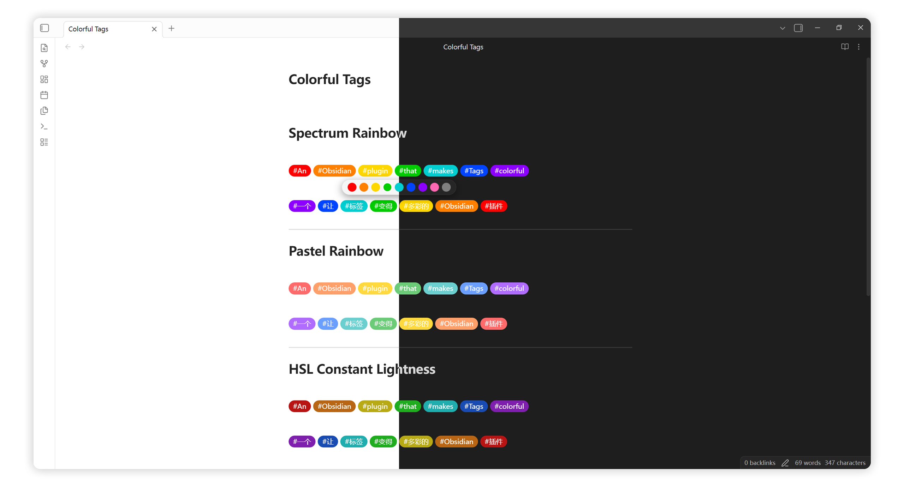

<div align="center">

### 多彩标签

一个让标签变得多彩的 Obsidian 插件

[English](README.md) / 中文



</div>

## 💻 功能

- **自动分配颜色** — 根据标签首字符的 Unicode 编码自动分配 9 种颜色之一，同名标签始终同色
- **快捷选色弹窗** — 在编辑视图悬浮标签即可快速改色
- **自定义标签颜色** — 为指定标签固定颜色编号
- **自定义颜色值** — 在设置中点击颜色块可自定义背景色和文字色
- **阅读 + 编辑视图** — 同时支持阅读视图和实时编辑视图

## 🚀 安装

### 方法一：使用 BRAT 安装

1. 安装 [BRAT](https://github.com/TfTHacker/obsidian42-brat)
2. 打开 BRAT 设置 → **Add Beta plugin**
3. 粘贴仓库地址：`https://github.com/Hsyoungtick/obsidian-colorful-tags`
4. 启用插件

### 方法二：手动安装

1. 从 [Releases](https://github.com/Hsyoungtick/obsidian-colorful-tags/releases) 下载 `main.js`、`styles.css`、`manifest.json`
2. 在 `.obsidian/plugins/` 下创建 `colorful-tags` 文件夹
3. 将下载的文件移动到 `.obsidian/plugins/colorful-tags/`
4. 重启 Obsidian，在设置中启用插件

## 📖 使用方法

### 自动着色

输入标签时自动着色。颜色由标签名的首字符通过 `codePointAt(0) % 9 + 1` 计算，因此同名标签始终获得相同颜色。

### 快捷选色（编辑视图）

在编辑视图中悬浮任意标签，会弹出 9 个颜色圆圈。点击其中一个即可将该标签固定到指定颜色编号。

### 标签字典

在设置面板中，可以管理标签名对应颜色编号。输入标签名（不含 `#`），用逗号分隔。


## 🏗️ 开发

```bash
# 安装依赖
pnpm install

# 开发模式（监听文件变化）
pnpm dev

# 生产构建
pnpm build

# 运行测试
pnpm test
```

开发时如需自动复制到 Vault，创建 `.devconfig.json`：

```json
{
  "vaultPluginPaths": [
    "/你的Vault路径/.obsidian/plugins/colorful-tags"
  ]
}
```

## ✨ 灵感来源

- [obsidian-colorful-tag](https://github.com/rien7/obsidian-colorful-tag): 让你的标签更美观、更强大！
- [CSS片段-标签多彩小丸子](https://coffeetea.top/zh/css-snippets/%E6%A0%87%E7%AD%BE%E5%A4%9A%E5%BD%A9%E5%B0%8F%E4%B8%B8%E5%AD%90.html): 实现修改标签为多彩的颜色，一共7种颜色，依次变化

## 🤖 免责声明

本项目由 AI 辅助生成，介意者请慎用。

## 📝 许可证

[MIT](LICENSE)
